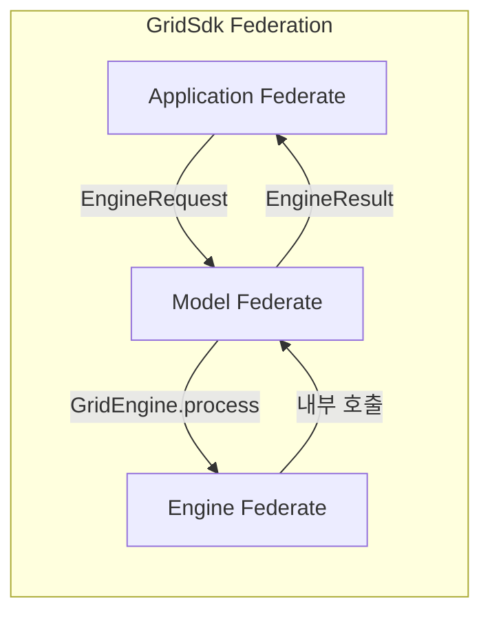
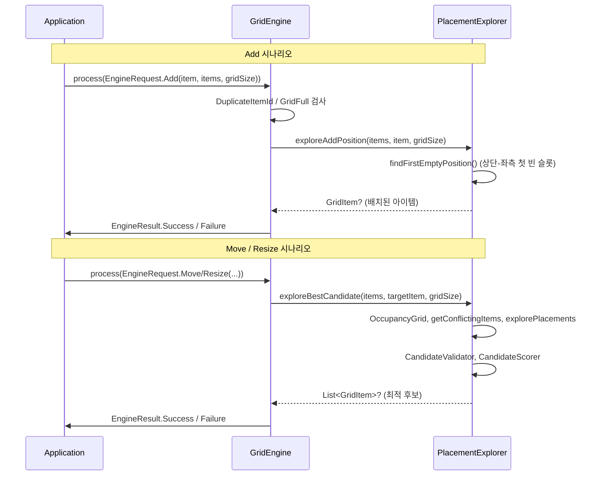
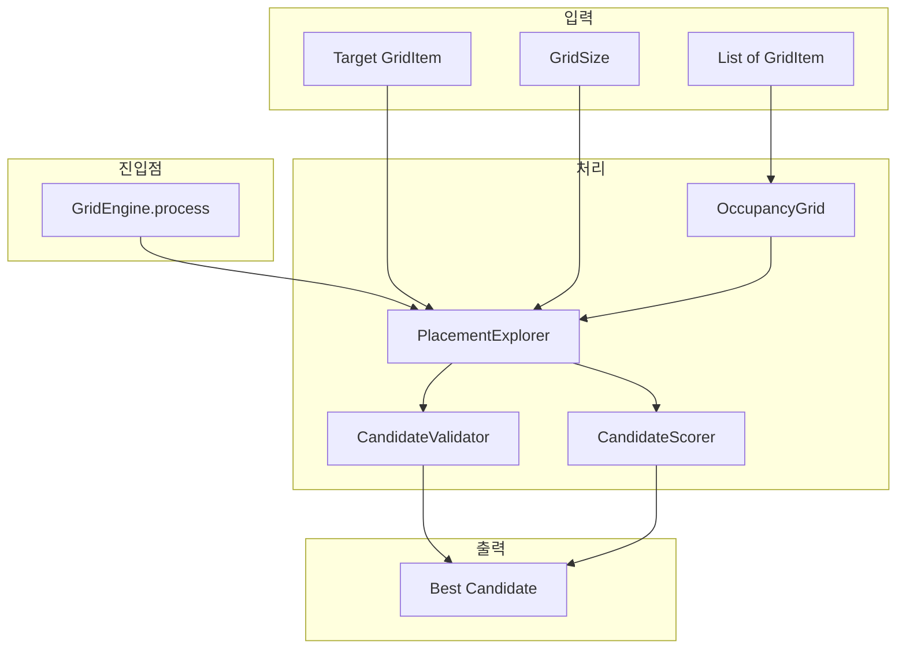
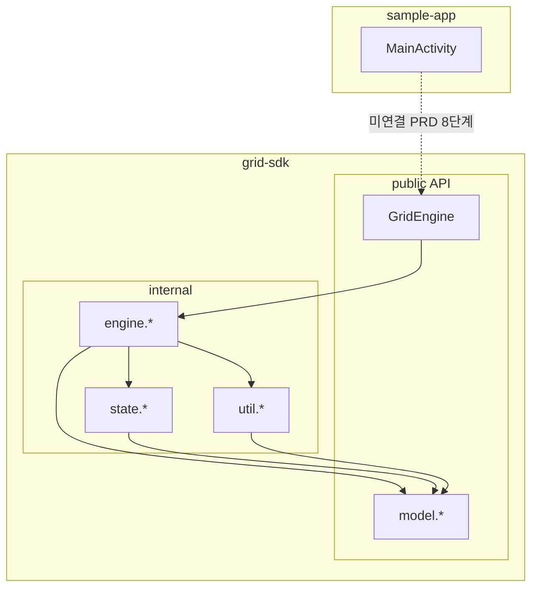

# GridSdk High Level Architecture (HLA)

GridSdk 프로젝트의 현재 개발 구조를 HLA(High Level Architecture) 관점에서 정리한 아키텍처 문서입니다.

---

## 1. Federation 개요

GridSdk는 **Jetpack Compose 기반 그리드 레이아웃 SDK**로, N×M 고정 그리드에서 아이템의 추가/이동/리사이즈를 지원합니다. 전체 시스템은 **3개의 주요 Federate(서브시스템)**으로 구성됩니다.



---

## 2. Federates (서브시스템)

### 2.1 Application Federate (Consumer)

| 항목 | 설명 |
|------|------|
| **위치** | `sample-app` 모듈 |
| **역할** | SDK를 사용하는 앱. UI 렌더링, 제스처 처리, 상태 관리 |
| **현재 상태** | 기본 Compose 스캐폴드만 구현됨. Grid SDK 연동 미완료 (PRD 8단계) |
| **주요 파일** | `sample-app/src/main/java/com/android/gridsdk/sample/MainActivity.kt` |

### 2.2 Model Federate (공개 API / 계약)

| 항목 | 설명 |
|------|------|
| **위치** | `grid-sdk/.../model/` |
| **역할** | 도메인 모델, 엔진 입출력 DTO, 에러 타입 정의. **외부 공개 API** |
| **주요 타입** | `GridItem`, `GridSize`, `GridError`, `EngineRequest`, `EngineResult`, `GridEngine` |

**Object Model (공개 데이터 구조):**

| Object | 용도 |
|--------|------|
| `GridSize(rows, columns)` | N×M 그리드 크기 |
| `GridItem(id, x, y, spanX, spanY)` | 그리드 내 아이템 |
| `EngineRequest` (sealed) | `Move`, `Resize`, `Add` 요청 |
| `EngineResult` (sealed) | `Success(targetItem, relocatedItems)` / `Failure(error)` |
| `GridEngine` (object) | `process(request)`: EngineRequest → EngineResult 공개 진입점 |
| `GridError` (sealed) | `OutOfBounds`, `NoFeasibleLayout`, `ItemOverlap`, `ItemNotFound`, `InvalidItem`, `GridFull`, `DuplicateItemId` |

### 2.3 Engine Federate (내부 구현)

| 항목 | 설명 |
|------|------|
| **위치** | `grid-sdk/.../internal/` |
| **역할** | 배치 계산, 유효성 검사, 후보 탐색. **internal** 패키지로 격리 |
| **구성** | state, engine, util 3개 하위 패키지 |

**하위 컴포넌트:**

| 컴포넌트 | 패키지 | 역할 |
|----------|--------|------|
| `OccupancyGrid` | `internal.state` | 셀별 점유 상태(2D 배열), 충돌 감지 |
| `StateSnapshot` | `internal.state` | 적용/롤백용 이전·새 아이템 목록 스냅샷 |
| `PlacementExplorer` | `internal.engine` | 후보 배치 탐색, 상단-좌측 빈 공간 탐색, Add 전용 `findFirstEmptyPosition`/`exploreAddPosition` |
| `CandidateValidator` | `internal.engine` | 경계·중복 제약 검사 |
| `CandidateScorer` | `internal.engine` | 재배치 수, 맨해튼 거리, 상단-좌측 우선순위 스코어링 |
| `ResizeInteractionState` | `internal.interaction` | LongPress → Drag 리사이즈 진입 상태 머신 |
| `ResizeSpanCalculator` | `internal.util` | 드래그 기반 span 계산, clamp, 히스테리시스(깜빡임 방지) |
| `ValidationUtils` | `internal.util` | 좌표/경계/겹침 검사 유틸 |

---

## 3. Interaction Model (상호작용)

### 3.1 요청-응답 흐름

**공개 진입점: `GridEngine.process(request)`**



### 3.2 Engine 내부 데이터 흐름



**Add 전용 흐름:** `GridEngine` → `PlacementExplorer.findFirstEmptyPosition` → `exploreAddPosition` → 배치된 `GridItem` 반환

### 3.3 모듈 의존성



---

## 4. 패키지 구조 요약

```
GridSdk/
├── grid-sdk/                    # 라이브러리 모듈
│   └── com.android.gridsdk.library/
│       ├── model/               # 공개 API
│       │   ├── GridItem.kt
│       │   ├── GridSize.kt
│       │   ├── GridError.kt
│       │   └── engine/
│       │       ├── EngineRequests.kt
│       │       ├── EngineResults.kt
│       │       └── GridEngine.kt      # Engine Facade (공개 진입점)
│       └── internal/            # 내부 구현
│           ├── InternalApi.kt
│           ├── interaction/
│           │   └── ResizeInteractionState.kt
│           ├── state/
│           │   ├── OccupancyGrid.kt
│           │   └── StateSnapshot.kt
│           ├── engine/
│           │   ├── PlacementExplorer.kt  # exploreBestCandidate, findFirstEmptyPosition, exploreAddPosition
│           │   ├── CandidateValidator.kt
│           │   └── CandidateScorer.kt
│           └── util/
│               ├── ResizeSpanCalculator.kt
│               └── ValidationUtils.kt
└── sample-app/                  # 샘플 앱
    └── com.android.gridsdk.sample/
```

---

## 5. 미구현/진행 중 항목 (PRD 기준)

- ~~**Add 로직**~~: **완료** (4단계) - `PlacementExplorer.findFirstEmptyPosition`, `exploreAddPosition` 구현, `GridEngine.process(Add)` 지원
- ~~**Engine Facade**~~: **완료** (4단계) - `GridEngine.process(request)` 공개 진입점 구현
- ~~**Move 로직**~~: **완료** (5단계) - `GridEngine.processMove` 경계 검증(OutOfBounds), `exploreBestCandidate` 충돌 재배치, `GridEngineMoveTest` 단위 테스트
- ~~**Resize 로직**~~: **완료** (6단계) - `ResizeInteractionState`, `ResizeSpanCalculator`, `GridEngine.processResize` (OutOfBounds/InvalidItem 검증), `GridEngineResizeTest` 단위 테스트
- **롤백 규칙**: 드래그 중 원위치 복귀 로직 미구현 (7단계)
- **Compose 통합**: 공개 Composable, 제스처 핸들러, 애니메이션 브리지 미구현 (8단계)
