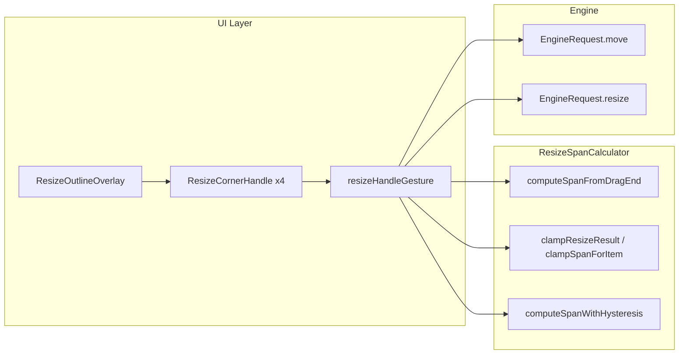

# 리사이즈 핸들러 동작 로직 분석

## 1. 구조 요약

- **코너 정의**: [ResizeCorner.kt](../src/main/kotlin/com/android/gridsdk/library/internal/util/ResizeCorner.kt)  
  `TopStart`(좌상), `TopEnd`(우상), `BottomStart`(좌하), `BottomEnd`(우하). 각 코너는 "고정되는 모서리"를 정의함.
- **진입점**: 롱프레스로 리사이즈 모드 진입 → [GridLayoutInternal.kt](../src/main/kotlin/com/android/gridsdk/library/internal/ui/GridLayoutInternal.kt)의 `ResizeOutlineOverlay`에서 4개 코너에 `ResizeCornerHandle` 배치 → 각 핸들에 `resizeHandleGesture` 적용.
- **제스처 처리**: [ResizeGestureHandler.kt](../src/main/kotlin/com/android/gridsdk/library/internal/ui/ResizeGestureHandler.kt)에서 `detectDragGestures`로 드래그만 처리 (롱프레스는 상위에서 처리).

---

## 2. 공통 전처리 (모든 코너)

`ResizeGestureHandler.resizeHandleGesture` 내부, `detectDragGestures { change, _ -> ... }` 블록에서 매 드래그마다:

1. **현재 아이템/오버레이 크기**
   - `itemsState.value`에서 `item.id`로 현재 `GridItem` 조회 (없으면 인자 `item` 사용).
   - `overlaySizeState.value`로 현재 오버레이 (widthPx, heightPx) 사용.
2. **드래그 끝 지점 → 그리드 셀 좌표**
   - 아이템 좌상 기준 오프셋 `itemOffsetPx = (item.x * cellWidthPx, item.y * cellHeightPx)`.
   - 코너별 **핸들 위치** `currentHandleOffsetPx`:
     - TopStart: (0, 0)
     - TopEnd: (overlayWidth - handleSize, 0)
     - BottomStart: (0, overlayHeight - handleSize)
     - BottomEnd: (overlayWidth - handleSize, overlayHeight - handleSize)
   - `gridPos = change.position + itemOffsetPx + currentHandleOffsetPx`.
   - **셀 경계 규칙**: 셀의 50%를 넘어야 다음 셀로 인정.
     - `dragEndCellX = ((gridPos.x - 0.5f * cellWidthPx) / cellWidthPx).toInt().coerceIn(0, columns-1)`
     - `dragEndCellY` 동일 (rows 기준).

이후 **코너별** 분기로 새 (x, y, spanX, spanY) 또는 (spanX, spanY)를 구하고, 프리뷰 콜백을 호출한 뒤 필요 시 엔진(Move/Resize) 호출.

---

## 3. 코너별 로직

### 3.1 BottomEnd (우하단) — "좌상 고정"

- **고정**: 아이템의 (x, y) 그대로. 드래그하는 쪽은 우하단.
- **span 계산**:
  - `dragEndX = dragEndCellX.coerceIn(item.x, columns-1)`, `dragEndY = dragEndCellY.coerceIn(item.y, rows-1)`.
  - [ResizeSpanCalculator.computeSpanFromDragEnd](../src/main/kotlin/com/android/gridsdk/library/internal/util/ResizeSpanCalculator.kt):  
    `spanX = dragEndX - item.x + 1`, `spanY = dragEndY - item.y + 1` 후 `clampSpanForItem`.
  - 프리뷰는 **픽셀 크기**만: `previewWidthPx = gridPos.x - itemOffsetPx.x` (및 height)를 셀 단위 경계로 clamp 후 `onPreviewSizePxChange` 호출.  
  - **offset 콜백 미호출** (좌상 고정이므로 위치 변경 없음).
- **히스테리시스**: [computeSpanWithHysteresis](../src/main/kotlin/com/android/gridsdk/library/internal/util/ResizeSpanCalculator.kt)로 1셀 미만 변화 시 이전 span 유지 (지터 방지).
- **엔진 호출**: **Resize만** 한 번.  
  `GridEngine.process(EngineRequest.resize(item.id, targetSpanX, targetSpanY, items, gridSize))` → Success면 `bridge.applySuccess`, Failure면 `bridge.applyFailure`.

### 3.2 TopStart (좌상단) — "우·하 고정"

- **고정**: `fixedRight = item.x + item.spanX - 1`, `fixedBottom = item.y + item.spanY - 1`.
- **새 위치·span**:
  - `newX = dragEndCellX.coerceIn(0, fixedRight)`, `newY = dragEndCellY.coerceIn(0, fixedBottom)`.
  - `newSpanX = (fixedRight - newX + 1).coerceAtLeast(1)`, `newSpanY = (fixedBottom - newY + 1).coerceAtLeast(1)`.
  - [ResizeSpanCalculator.clampResizeResult](../src/main/kotlin/com/android/gridsdk/library/internal/util/ResizeSpanCalculator.kt)(newX, newY, newSpanX, newSpanY, gridSize)로 그리드 경계 내 (clampedX, clampedY, clampedSpanX, clampedSpanY) 적용.
- **프리뷰**: `onPreviewOffsetPxChange(newX * cellWidthPx, newY * cellHeightPx)`, `onPreviewSizePxChange(newSpanX * cellWidthPx, newSpanY * cellHeightPx)`, `onPreviewSpanChange(newSpanX, newSpanY)`.
- **엔진 호출**: (newX, newY, targetSpanX, targetSpanY)가 현재와 모두 같으면 스킵.  
  그 외: **먼저 Move**, **이후 Resize**.
  - `GridEngine.process(EngineRequest.move(item.id, newX, newY, items, gridSize))`.
  - 실패 시 `applyFailure` 후 return.
  - 성공 시 `newItems = moveResult.applyTo(items)`, `applySuccess(moveResult, ...)` 호출한 뒤  
    `GridEngine.process(EngineRequest.resize(item.id, targetSpanX, targetSpanY, newItems, gridSize))` → Success/Failure 각각 `applySuccess`/`applyFailure`.

### 3.3 TopEnd (우상단) — "좌·하 고정"

- **고정**: x = `item.x`, `fixedBottom = item.y + item.spanY - 1`.
- **새 위치·span**:
  - `dragEndX = dragEndCellX.coerceIn(item.x, columns-1)`, `newY = dragEndCellY.coerceIn(0, fixedBottom)`.
  - `newSpanX = (dragEndX - item.x + 1).coerceAtLeast(1)`, `newSpanY = (fixedBottom - newY + 1).coerceAtLeast(1)`.
  - `clampResizeResult(item.x, newY, newSpanX, newSpanY, gridSize)` 사용.
- **프리뷰**: offset = (item.x * cellWidthPx, newY * cellHeightPx), size/span 위와 동일 방식.
- **엔진**: 현재와 같으면 스킵. 그 외 **Move(item.id, item.x, newY, ...)** → 성공 시 **Resize(item.id, targetSpanX, targetSpanY, newItems, ...)**.

### 3.4 BottomStart (좌하단) — "우·상 고정"

- **고정**: `fixedRight = item.x + item.spanX - 1`, y = `item.y`.
- **새 위치·span**:
  - `newX = dragEndCellX.coerceIn(0, fixedRight)`, `dragEndY = dragEndCellY.coerceIn(item.y, rows-1)`.
  - `newSpanX = (fixedRight - newX + 1).coerceAtLeast(1)`, `newSpanY = (dragEndY - item.y + 1).coerceAtLeast(1)`.
  - `clampResizeResult(newX, item.y, newSpanX, newSpanY, gridSize)`.
- **프리뷰**: offset = (newX * cellWidthPx, item.y * cellHeightPx), size/span 동일.
- **엔진**: **Move(item.id, newX, item.y, ...)** → **Resize(item.id, targetSpanX, targetSpanY, newItems, ...)**.

---

## 4. 엔진 측 Resize 의미

- [GridEngine.processResize](../src/main/kotlin/com/android/gridsdk/library/model/engine/GridEngine.kt):  
  `targetItem.resize(targetSpanX, targetSpanY)`만 호출 → [GridItem.resize](../src/main/kotlin/com/android/gridsdk/library/model/GridItem.kt)는 **x, y 유지, spanX/spanY만 변경**.
- 따라서 "고정이 좌상이 아닌" 코너(TopStart, TopEnd, BottomStart)는 **위치가 바뀌므로** UI에서 먼저 Move로 (newX, newY)를 반영한 뒤, 같은 (targetSpanX, targetSpanY)로 Resize를 호출하는 구조가 됨.

---

## 5. 드래그 종료/취소

- `onDragEnd` / `onDragCancel`:  
  `onPreviewSpanChange(null)`, `onPreviewSizePxChange(null)`, `onPreviewOffsetPxChange(null)` 호출 후 `bridge.clearTracker()`.

---

## 6. 요약 표 (코너별)

| 코너        | 고정되는 쪽     | 위치 변경   | 엔진 호출 순서      | offset 프리뷰 |
|------------|-----------------|-------------|---------------------|----------------|
| BottomEnd  | 좌상 (x, y)     | 없음        | Resize만            | 없음           |
| TopStart   | 우·하           | 있음        | Move → Resize       | 있음           |
| TopEnd     | 좌·하           | 있음 (y만)  | Move → Resize       | 있음           |
| BottomStart| 우·상           | 있음 (x만)  | Move → Resize       | 있음           |

이 분석을 바탕으로 리사이즈 동작을 수정하거나 확장할 때는 `ResizeGestureHandler`의 코너별 분기와 `ResizeSpanCalculator`의 clamp/히스테리시스, 그리고 Move/Resize 호출 순서를 함께 보면 됩니다.
